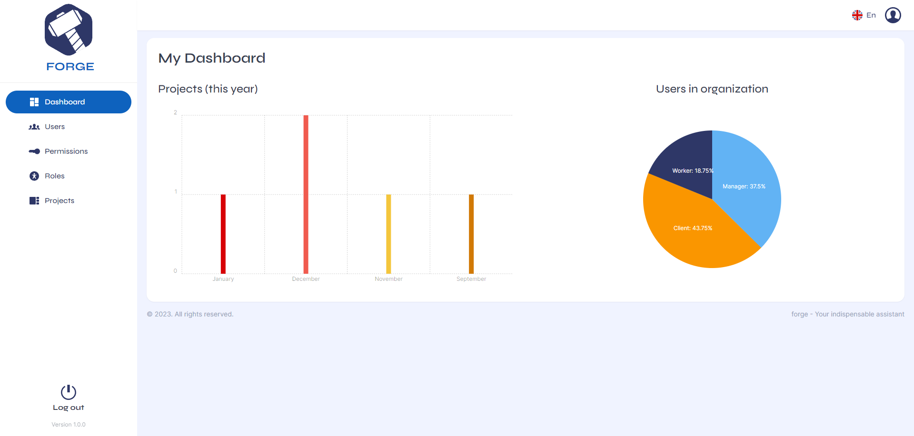
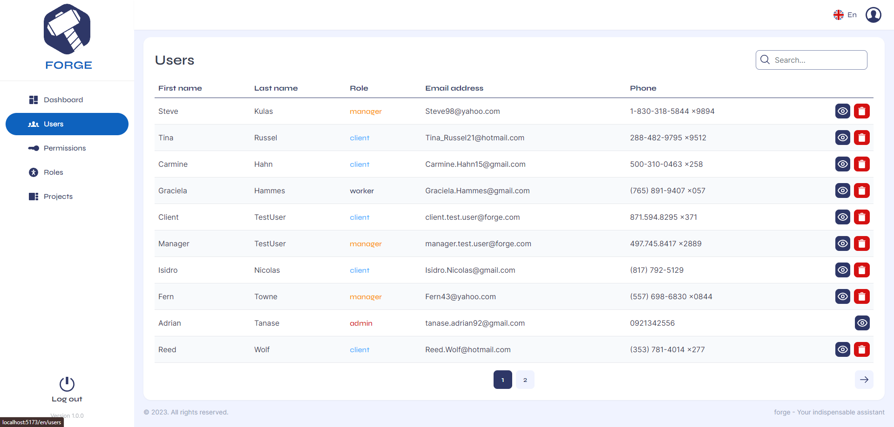
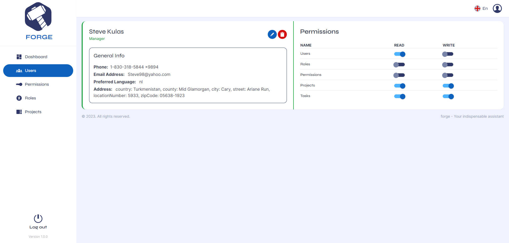
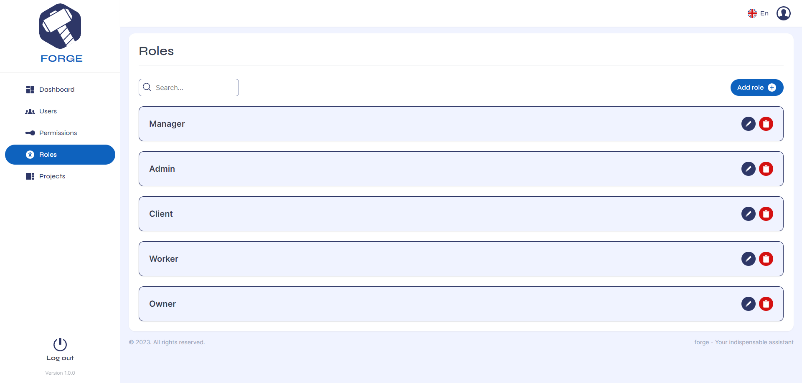
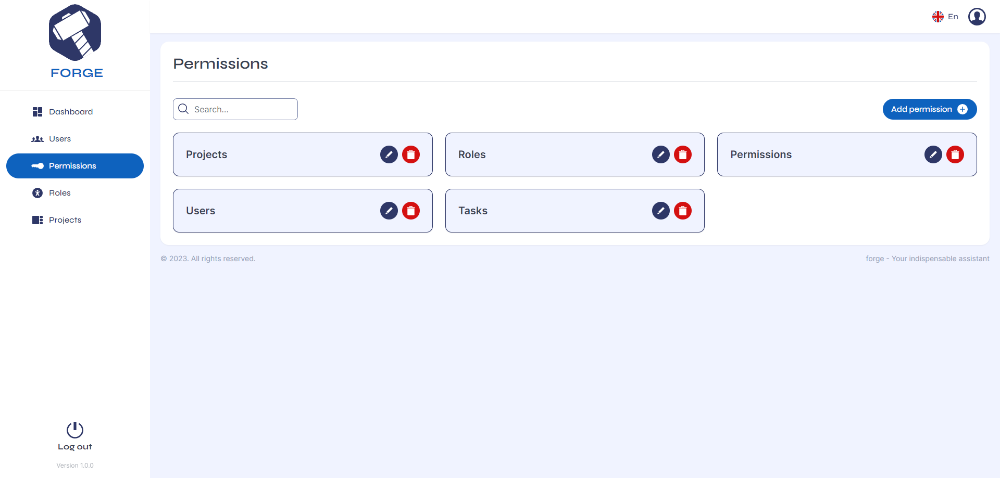
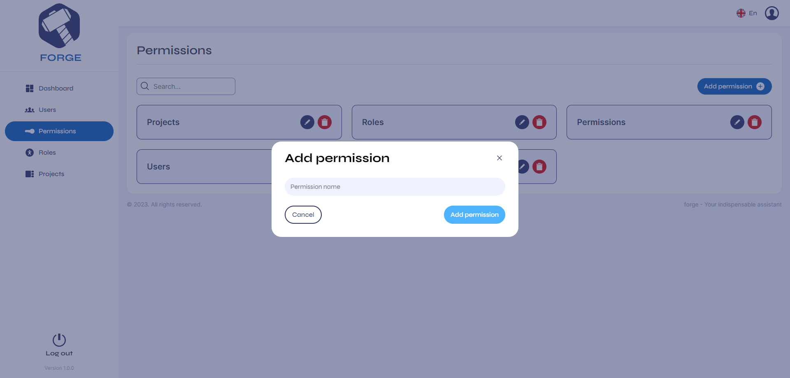
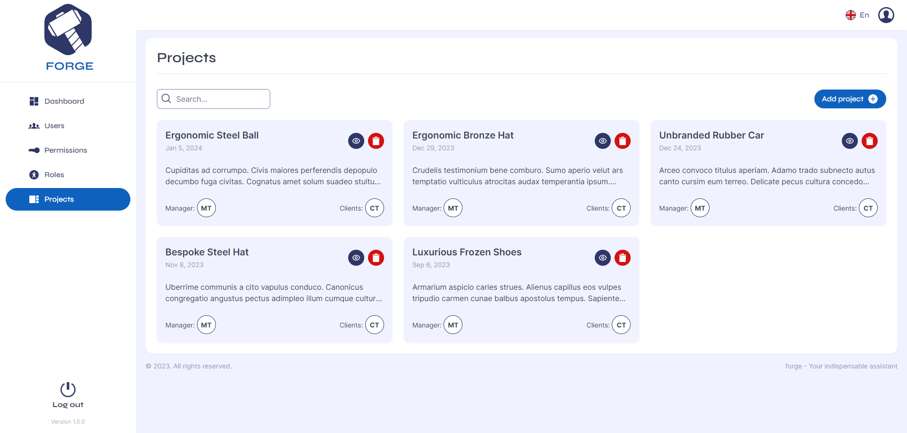
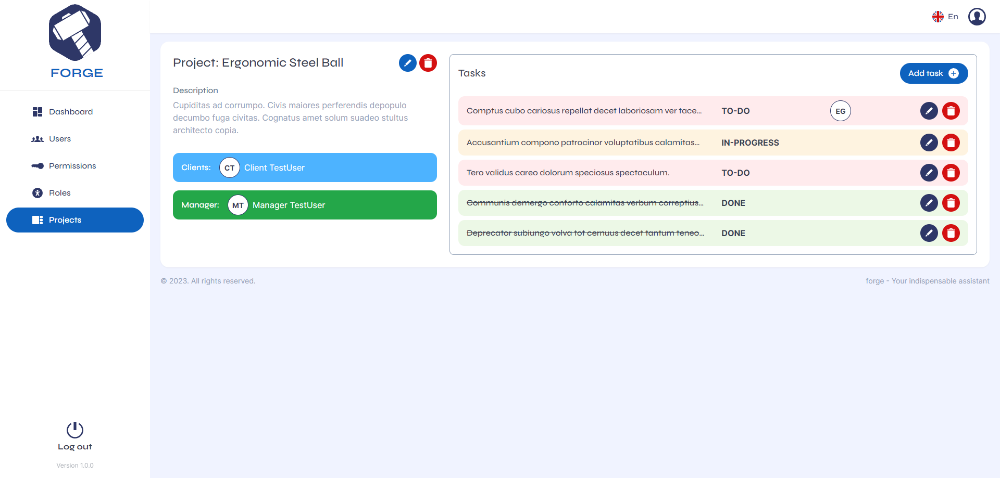

<div align="center">
  <h1>Forge - Project Management System</h1>
</div>

<div align="center">
  <a href="https://pnpm.io/pnpm-vs-npm" target="_blank">
    
  </a>
  <a href="https://nodejs.org/en" target="_blank">
    
  </a>
  <a href="https://www.docker.com/products/docker-desktop/" target="_blank">
    
  </a>
  <a href="https://www.npmjs.com/package/typescript" target="_blank">
    
  </a>
  <a href="https://www.npmjs.com/package/fastify" target="_blank">
    
  </a>
  <a href="https://www.npmjs.com/package/mongodb" target="_blank">
    
  </a>
  <a href="https://www.npmjs.com/package/zod" target="_blank">
    
  </a>
  <a href="https://www.npmjs.com/package/svelte" target="_blank">
    
  </a>
  <a href="https://www.npmjs.com/package/@sveltejs/kit" target="_blank">
    
  </a>
</div>

## Overview

Forge is a full-stack application designed to showcase modern web development practices and tooling.
It is built entirely for portfolio purposes and demonstrates a real-world project structure and
workflow.

This monorepo, managed with `pnpm`, contains two main packages:

-   **forge-main-server**: The backend server, built with Fastify, TypeScript, and MongoDB.
-   **forge-main-client**: The frontend client, created using SvelteKit and TypeScript.

## Getting Started

### Run project locally

If you want to open this project **locally**, then you need these:

-   Node.js (v20 or later)
-   MongoDB (v6.3.0 or later)
-   pnpm (v8 or later) Now follown these steps:

1. Clone the project:

```sh
git clone https://github.com/adriantanase92/forge.git
```

2. Download the env file from
   [here](https://drive.google.com/file/d/1lKn7d2WIOPSMdRI7vR3v-a6oh44LJZKV/view?usp=sharing) and
   put it in the root of your project
3. Run command `pnpm install` in the root of your project
4. Open a terminal from the root of the project and navigate into `packages/forge-main-client` and
   run command `pnpm run dev`
5. Open another terminal from the root of the project and navigate into `packages/forge-main-server`
   and run command `pnpm run dev`
6. These are the urls for the project:

-   frontend: `http://localhost:5173`
-   backend: `http://localhost:3010`

### Run project in Docker

For **docker** you just need to:

1. Clone the project into your local machine:

```sh
git clone https://github.com/adriantanase92/forge.git
```

2. Download the env file from
   [here](https://drive.google.com/file/d/1lKn7d2WIOPSMdRI7vR3v-a6oh44LJZKV/view?usp=sharing) and
   put it in the root of your project
3. In the env file do these:

-   for **NODE_ENV** set `production` instead of `development`
-   for **PUBLIC_MAIN_SERVER_URL** set `http://forge-main-server:3010` instead of
    `http://localhost:3010`

4. Run the docker build and run command (if you have
   [docker-desktop](https://www.docker.com/products/docker-desktop/)): `docker compose up --build`.
5. These are the urls for the project:

-   frontend: `http://localhost:3000`
-   backend: `http://localhost:3010`

Here are some commands for docker to help you out:

```sh
# Build and run command
docker compose up --build
# Run without building
docker compose up -d
# Shut down the docker containers
docker compose down
```

## Features

-   **User Authentication**: Secure login and registration functionality.
-   **Project Management**: Create, edit, and manage projects and tasks with ease.
-   **Task Tracking**: Assign and track tasks within each project.

## Technologies Used

-   Backend (forge-main-server)
    -   Fastify for efficient server-side handling.
    -   TypeScript for type-safe code.
    -   MongoDB as a NoSQL database.
-   Frontend (forge-main-client)
    -   SvelteKit for a fast and modern web framework.
    -   TypeScript for consistent, type-safe code.

## What to expect?

### Login screen


### Dashboard screen



### Users screens





### Roles screen



### Permissions screens





### Projects screens




